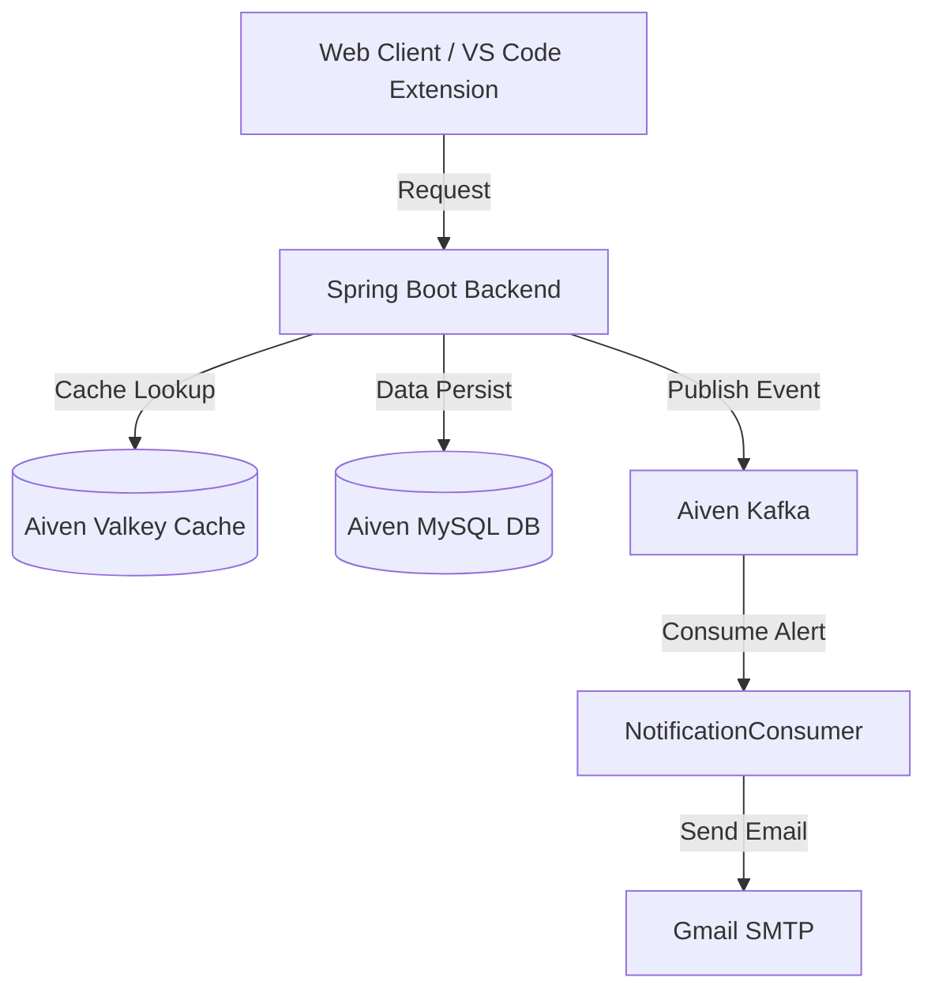

# Kyvora Production Deployment & Configuration Guide

This guide explains how to deploy the Kyvora backend service on **Render.com** configured with your external cloud-based **Aiven** services (**Kafka**, **MySQL**, and **Valkey**), and how the notification alert system works.

---

## ☁️ Aiven Cloud Services Configuration

We have pre-configured the backend to connect directly to your Aiven instances by default, with overrides available via environment variables:

| Service | Parameter | Value / Connection URL |
| :--- | :--- | :--- |
| **MySQL (Aiven)** | Host / Port | `mysql-fd2cdb4-glal86500-7941.c.aivencloud.com:28952` |
| | Database | `kyvora` |
| | Username / Password | `avnadmin` / `AVNS_N0y5EZPLSxcBWgylWzf` |
| **Valkey (Aiven)** | Host / Port | `valkey-32754410-glal86500-7941.j.aivencloud.com:28953` (SSL: Secure) |
| | Username / Password | `default` / `AVNS_wN3j0xmo9xKIzZCS8Xk` |
| **Kafka (Aiven)** | Bootstrap Servers | `kafka-3855308e-glal86500-7941.i.aivencloud.com:28965` (SASL_SSL / SCRAM-SHA-256) |
| | Username / Password | `avnadmin` / `AVNS_ZDGDYioJ37VqELPgP3p` |

> [!NOTE]
> **Aiven Kafka Free/Trial Partition Policy:** 
> Aiven enforces a limit of **maximum 2 partitions per topic** for free/trial instances. Standard Kafka configurations default to 3 or more partitions, which will trigger a `PolicyViolationException` and block startup.
> We have set all topics to `.partitions(1)` in `KafkaTopicConfig.java` to stay within limits. Ensure any manually created topics follow this policy!

---

## 🚀 Render.com Deployment Guide

To deploy the Spring Boot backend on Render using the included Dockerfile:

### Step 1: Create a Web Service on Render
1. Go to your **Render Dashboard** (https://dashboard.render.com/) and click **New +** -> **Web Service**.
2. Connect your GitHub repository containing this codebase.
3. Set the following basic parameters:
   - **Name:** `kyvora-backend`
   - **Language:** `Docker` (Render will automatically detect the `Dockerfile` inside the `kyvora-backend` subfolder or root).
   - **Root Directory:** `kyvora-backend` (Since the java project is inside the `kyvora-backend` folder).

### Step 2: Configure Render Environment Variables
Under the **Environment** tab in your Render Web Service settings, add the following environment variables. 
These are already mapped to the default Aiven configuration in `application.yml`, but defining them explicitly in Render guarantees complete control:

```env
# 1. database configuration
DATABASE_URL=jdbc:mysql://mysql-fd2cdb4-glal86500-7941.c.aivencloud.com:28952/kyvora?useSSL=true&requireSSL=true&verifyServerCertificate=false&serverTimezone=UTC&allowPublicKeyRetrieval=true
DATABASE_USER=avnadmin
DATABASE_PASS=AVNS_N0y5EZPLSxcBWgylWzf

# 2. valkey (redis) configuration (ssl is enabled)
REDIS_HOST=valkey-32754410-glal86500-7941.j.aivencloud.com
REDIS_PORT=28953
REDIS_PASSWORD=AVNS_wN3j0xmo9xKIzZCS8Xk
REDIS_USER=default
REDIS_SSL_ENABLED=true

# 3. kafka configuration (secure sasl_ssl with scram-sha-256)
KAFKA_BOOTSTRAP_SERVERS=kafka-3855308e-glal86500-7941.i.aivencloud.com:28965
KAFKA_SECURITY_PROTOCOL=SASL_SSL
KAFKA_SASL_MECHANISM=SCRAM-SHA-256
KAFKA_JAAS_CONFIG=org.apache.kafka.common.security.scram.ScramLoginModule required username="avnadmin" password="AVNS_ZDGDYioJ37VqELPgP3p";

# 4. gmail alerts configurations
SPRING_MAIL_HOST=smtp.gmail.com
SPRING_MAIL_PORT=587
SPRING_MAIL_USERNAME=pv254424@gmail.com
SPRING_MAIL_PASSWORD=your_16_character_gmail_app_password
RECIPIENT_EMAIL=pv254424@gmail.com

# 5. ai apis (copied from your local .env)
GEMINI_API_KEY=your_gemini_key
OPENROUTER_API_KEY=your_openrouter_key
GROQ_API_KEY=your_groq_key
HUGGINGFACE_API_KEY=your_huggingface_key
SAMBANOVA_API_KEY=your_sambanova_key
```

> [!IMPORTANT]
> **Gmail App Password Requirement:**
> You must generate a **16-character App Password** from your Google account settings to populate `SPRING_MAIL_PASSWORD`.
> 1. Go to your **Google Account settings** -> **Security**.
> 2. Turn ON **2-Step Verification**.
> 3. Go to **App passwords** (at the bottom of 2-Step Verification).
> 4. Select **Other**, name it `Kyvora Production`, and click **Generate**.
> 5. Use the 16-character code as `SPRING_MAIL_PASSWORD`.

### Step 3: Trigger Build and Deploy
Click **Create Web Service**. Render will spin up a builder container, execute `mvn clean package` inside the multi-stage Maven build, pack it into a minimal JRE-21 image, and start the app on port `8080`.

---

## ⚙️ Backend Integration Architecture



### 1. Valkey (Aiven Caching)
*   **Profile Caching (Demo):** When a user requests their profile via `/api/v1/users/profile`, the backend checks Aiven Valkey first (`kyvora:user:profile:<username>`). 
    *   **Cache Hit:** If found, it returns the profile from Valkey (Source: `Valkey Cache`).
    *   **Cache Miss:** If not found, it queries MySQL, stores it in Valkey for 60 seconds (with TTL), and returns it (Source: `MySQL Database`).

### 2. Kafka Notification System
*   **VS Code Login Alerts:** When a user logs in, the backend checks client headers. If the request comes from the **VS Code Extension** (which sends header `X-Client-Type: vscode`), it generates a custom login event.
*   **Kafka Queue:** The login event is published to Aiven Kafka's `kyvora-notifications` topic securely.
*   **Mail Consumer:** The `NotificationConsumer` listens to `kyvora-notifications` topic, formats a beautiful email, and fires it off to `pv254424@gmail.com` using the Gmail SMTP mail sender.

### 3. Role-Based Authentication (RBAC)
*   **Roles Supported:** `USER`, `EDITOR`, and `ADMIN`.
*   **Registration:** During `/signup`, the client can optionally request a specific role (e.g., `ADMIN` or `USER`).
*   **Role Enforcement:** Controllers use Spring's `@PreAuthorize` method-level security:
    *   `/api/v1/users/profile` can be accessed by anyone authenticated.
    *   `/api/v1/admin/users` is strictly locked to users with the `ADMIN` role. If a normal `USER` tries to call it, Spring returns a `403 Forbidden` response.

docker-compose up --build -d
