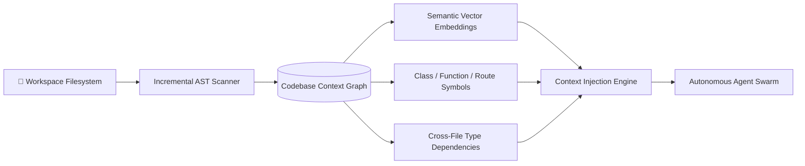
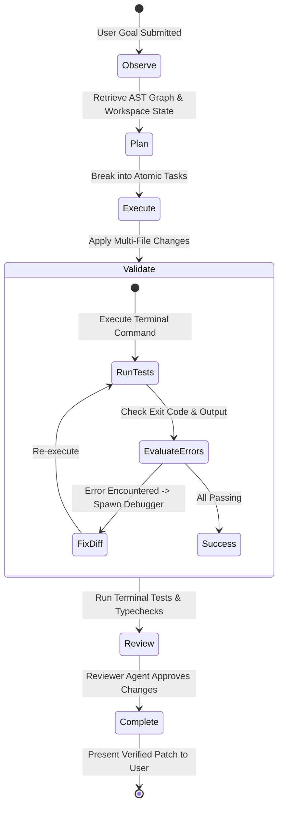
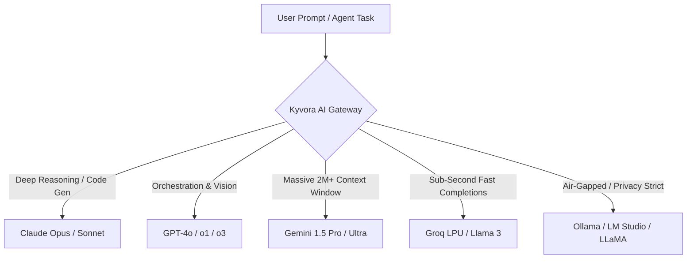

# 🤖 Kyvora AI & Autonomous Agent Swarms

Kyvora transforms development from manual line-by-line typing into **agentic orchestration**. Rather than functioning as a simplistic single-prompt chat sidebar, Kyvora implements a **coordinated multi-agent swarm** with specialized roles, deep AST semantic indexing, and autonomous terminal execution loops.

---

## 🧠 Codebase Context Graph & AST Indexing

Conventional AI assistants only ingest the currently open file buffer or top few search snippets, resulting in shallow, hallucinated code suggestions. 

Kyvora indexes your entire workspace into a **Semantic Context Graph**:



- **Incremental AST Parser:** Continuously watches file change events in the background, updating abstract syntax trees without freezing the editor.
- **Dependency Propagation:** Understands how a schema migration in a backend Spring Boot entity affects a frontend TypeScript interface or API client.
- **Project Boundary Hygiene:** Automatically respects `.gitignore`, skipping generated artifacts like `node_modules/`, `.next/`, `target/`, and binary blobs.

---

## 🐝 The Autonomous Agent Swarm

Kyvora features a built-in **Agent Registry** (`src/vs/workbench/contrib/kyvoraAgents/common/agentRegistry.ts`) hosting 12+ specialized autonomous agents:

| Agent | Priority | Preferred Model | Primary Responsibility |
| :--- | :---: | :--- | :--- |
| **Orchestrator** | `10` | `GPT-4o` / `Gemini Ultra` | Decomposes complex user goals into task graphs and coordinates child agents. |
| **Planner Agent** | `9` | `GPT-4o` / `Claude Sonnet` | Constructs execution DAGs, identifies checkpoints, and estimates blast radius. |
| **Architect Agent** | `8` | `Claude Opus` / `GPT-4o` | Evaluates system patterns, folder structures, ADRs, and architectural integrity. |
| **Coder Agent** | `7` | `Claude Sonnet` / `GPT-4o` | High-speed multi-file code implementation adhering to project coding styles. |
| **Backend Coder** | `7` | `Claude Sonnet` / `GPT-4o` | Specializes in REST, WebSockets, database schemas, auth, and ORM mappings. |
| **Frontend Coder** | `7` | `Claude Sonnet` / `GPT-4o` | Specializes in React 19, Next.js App Router, Tailwind v4, and UI animations. |
| **Tester Agent** | `5` | `Claude Sonnet` / `GPT-4o` | Writes unit/integration test suites and runs test CLI runners in the terminal. |
| **Reviewer Agent** | `6` | `Claude Opus` / `GPT-4o` | Audits code for bugs, anti-patterns, security gaps, and lint conformity. |
| **Debugger Agent** | `8` | `Claude Sonnet` / `Groq LPU` | Parses terminal build errors and stack traces to synthesize immediate hotfixes. |
| **Security Auditor** | `8` | `Claude Opus` / `GPT-4o` | Scans for secret leaks, SQL injection, insecure dependencies, and RBAC bypasses. |
| **DevOps Specialist**| `6` | `Claude Sonnet` / `GPT-4o` | Generates Dockerfiles, CI/CD pipelines, and cloud deployment configs. |
| **Doc Specialist** | `4` | `Claude Haiku` / `GPT-4o mini`| Synchronizes markdown docs, API references, and inline comments. |

---

## 🔄 The Autonomous Execution Loop

Kyvora's agents do not merely suggest code—they work autonomously through an **Observe-Plan-Act-Verify** loop:



1. **Observe:** Ingests the user's objective alongside current cursor context, recent file changes, and AST references.
2. **Plan:** The Planner creates an atomic step-by-step implementation plan.
3. **Execute:** The Coder applies multi-file changes using precise line-level patch tools.
4. **Validate:** Automatically executes background compilers (e.g. `npm run typecheck-client` or `mvn test`) and inspects output for errors.
5. **Self-Correction:** If compilation fails, the Debugger Agent autonomously reads the stack trace, adjusts the code, and re-tests until clean.

---

## 🛡️ Collaboration Protocols & Pipelines

Kyvora provides structured collaboration protocols to keep agents in lockstep:

- **`AutoReviewPipeline`:** Automatically triggered on file modification. The Reviewer agent checks code quality, imports, and security boundaries before files are staged.
- **`AutoTestPipeline`:** Spins up local test runners and reports real-time test outcomes to the workbench status badge.
- **`CollaborationPipeline`:** Manages agent-to-agent and human-to-agent task handoffs, conflict resolution, and shared memory updates.

---

## 🔌 Model Context Protocol (MCP) Gateway

Kyvora Studio includes an integrated **MCP Gateway** (`McpGatewayController`), enabling standard Model Context Protocol integrations with:
- External local databases (PostgreSQL, SQLite, MySQL).
- Git hosting providers (GitHub, GitLab).
- Cloud platforms (AWS, GCP, Render).
- Custom internal enterprise APIs and microservices.

---

## 🌐 Supported AI Providers & LLM Routing

Kyvora provides dynamic model routing across world-class commercial APIs and offline local runtimes:



### Configuring Workspace Agent Rules (`instructions.md`)

Create an `instructions.md` file in the root of your workspace to teach Kyvora's agents your project's unique conventions:

```markdown
# Kyvora Agent Instructions

## Code Conventions
- Use TypeScript with strict null checks.
- Follow functional programming paradigms where possible.
- Never write placeholder comments (e.g. `// TODO: implement`).

## Testing Standards
- All new service methods require corresponding unit tests in `src/test/`.
- Verify coverage before submitting patches.

## Security Rules
- Never hardcode secrets or credentials; use environment variables.
- All public endpoints must require authentication unless explicitly whitelisted.
```
