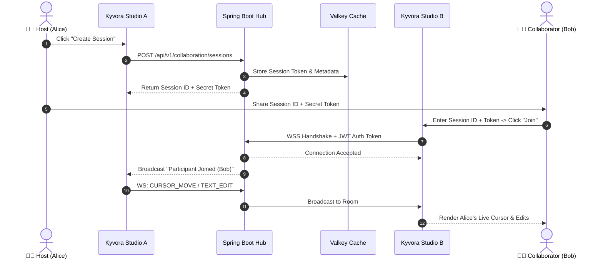

# 👥 Kyvora Real-Time Collaboration Guide

Kyvora features an enterprise-grade real-time pair programming engine embedded directly into **Kyvora Studio** and powered by the high-throughput **Spring Boot 3 + WebSocket** backend.

This guide explains how the collaboration system functions, how to test it locally across multiple instances, and the underlying network protocol.

---

## 🏗️ How Collaboration Works



---

## 🧪 Simulating Multi-User Collaboration Locally

You can test real-time collaboration on a single developer machine by launching **two independent instances** of Kyvora Studio with isolated profile storage directories.

### Step 1: Ensure Backend is Running
Ensure the Spring Boot backend is active on port `8080` (verify via `http://localhost:8080/api/v1/auth/login`).

### Step 2: Launch Two Isolated IDE Instances

Open two separate terminals and execute:

#### Terminal 1: Launch Instance A (Alice)
```powershell
.\scripts\code.bat --user-data-dir="C:\Users\himanshu vishwakarma\.gemini\antigravity\user-data-a" --extensions-dir="C:\Users\himanshu vishwakarma\.gemini\antigravity\extensions-a"
```

#### Terminal 2: Launch Instance B (Bob)
```powershell
.\scripts\code.bat --user-data-dir="C:\Users\himanshu vishwakarma\.gemini\antigravity\user-data-b" --extensions-dir="C:\Users\himanshu vishwakarma\.gemini\antigravity\extensions-b"
```

---

### Step 3: Sign In & Authentication

1. In **Instance A**, click the **Collaboration** icon on the primary activity bar.
2. If unauthenticated, the **Sign In to Kyvora** panel will appear. Click *"Don't have an account? Sign up"*.
3. Register with username `alice`, enter email and password, then log in.
4. In **Instance B**, repeat the process to register and log in with username `bob`.

---

### Step 4: Create & Join a Room

1. **In Instance A (`alice`):**
   - In the **Create Session** box, enter a session name (e.g., `Refactoring Sprint`).
   - Click **Create Session**.
   - Under the **Session Info** card, copy the generated **Session ID** and **Secret Token**.
2. **In Instance B (`bob`):**
   - Under the **Join Session** card, paste the **Session ID** and **Secret Token**.
   - Click **Join**.
   - A success notification will display: `"Connected to collaboration session!"`.
3. **Presence Confirmation:** Both instances will immediately display both `alice` and `bob` in the **Active Participants** sidebar with their assigned cursor colors.

---

### Step 5: Test Live Collaboration Channels

- **Live Code Sync:** Open any file in both editors. When Alice types, Bob immediately sees the changes in real-time with Alice's highlighted cursor position.
- **Team Chat:** Switch to the **Chat** tab in the collaboration panel. Send messages to verify bi-directional team conversation.
- **Shared Terminal:** Execute commands collaboratively in the terminal window.
- **Voice Status:** Toggle the microphone icon to broadcast active speaking / muted statuses across the session.

---

## 📡 WebSocket Network Packet Protocol

All collaboration messages pass over `ws://localhost:8080/ws-collaboration` (or `wss://...` in production) using standard JSON payloads:

### 1. Cursor & Selection Movement (`CURSOR_MOVE`)
Emitted whenever a participant's cursor position or active selection changes in the editor.

```json
{
  "type": "CURSOR_MOVE",
  "sessionId": "sess_8941fbc",
  "username": "alice",
  "payload": {
    "fileUri": "file:///src/index.ts",
    "lineNumber": 42,
    "column": 15,
    "selection": {
      "startLine": 42,
      "startColumn": 5,
      "endLine": 42,
      "endColumn": 15
    }
  }
}
```

### 2. Live Text Edits (`TEXT_EDIT`)
Transmits differential buffer modifications with range replacements.

```json
{
  "type": "TEXT_EDIT",
  "sessionId": "sess_8941fbc",
  "username": "alice",
  "payload": {
    "fileUri": "file:///src/index.ts",
    "range": {
      "startLine": 42,
      "startColumn": 1,
      "endLine": 42,
      "endColumn": 1
    },
    "text": "const connection = new SocketClient();\n",
    "version": 104
  }
}
```

### 3. Collaborative Chat (`CHAT_MESSAGE`)
```json
{
  "type": "CHAT_MESSAGE",
  "sessionId": "sess_8941fbc",
  "username": "bob",
  "payload": {
    "message": "I've reviewed the socket error handler. Looks solid!",
    "timestamp": 1726588231000
  }
}
```

### 4. Shared Terminal I/O (`TERMINAL_INPUT`)
```json
{
  "type": "TERMINAL_INPUT",
  "sessionId": "sess_8941fbc",
  "username": "alice",
  "payload": {
    "data": "npm run test\r"
  }
}
```

### 5. Voice Status (`VOICE_STATUS`)
```json
{
  "type": "VOICE_STATUS",
  "sessionId": "sess_8941fbc",
  "username": "bob",
  "payload": {
    "muted": false,
    "speaking": true
  }
}
```

---

## 🔒 Security & Room Isolation

- **Handshake Verification:** Before upgrading to WebSocket protocol, the `WebSocketAuthInterceptor` validates the bearer JWT token and ensures the user exists and is active.
- **Session Secrets:** Each collaboration room is protected by an ephemeral 256-bit cryptographically secure secret token. Unauthorized clients cannot eavesdrop or inject packets into the room without both the `sessionId` and `secretToken`.
- **RBAC Role Enforcement:** Only users with `EDITOR` or `ADMIN` roles can initialize write streams on shared buffers.
