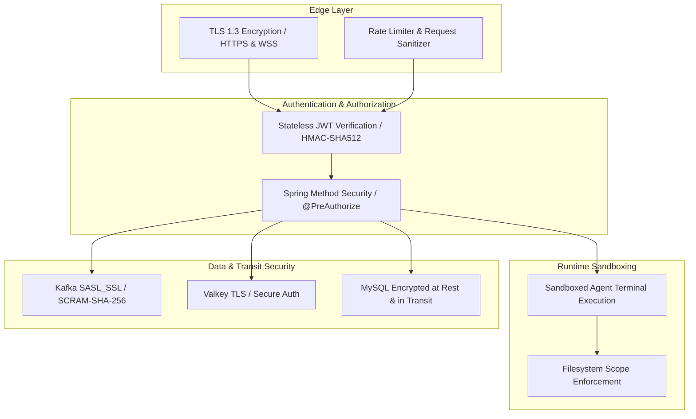

# 🛡️ Kyvora Security & Governance Policy

Security, data privacy, and operational integrity are fundamental design principles of the **Kyvora** software ecosystem. 

This document outlines Kyvora's security architecture, Role-Based Access Control (RBAC) model, data isolation guarantees, and responsible vulnerability disclosure guidelines.

---

## 🏛️ Security Architecture Overview

Kyvora implements a defense-in-depth security model across its client desktop, web, backend services, and cloud data tiers:



---

## 👥 Role-Based Access Control (RBAC)

Kyvora enforces strict, granular permissions across both HTTP REST endpoints and real-time WebSocket channels:

| Role | Permissions & Capabilities |
| :--- | :--- |
| **`ROLE_USER`** | Read access to public workspace metadata; personal AI query permissions; can join authorized collaboration rooms in read-only / viewer mode. |
| **`ROLE_EDITOR`** | Full pairing privileges; create and host collaboration rooms; issue real-time buffer edits; participate in shared terminal pairing; trigger autonomous agent code generators. |
| **`ROLE_ADMIN`** | Complete governance; access `/api/v1/admin/users`; inspect live cluster metrics; revoke tokens; audit user activities and system-wide telemetry. |

### Method-Level Enforcement Example
Backend endpoints enforce authorization at the Java controller level:

```java
// Strictly restricted to administrators
@PreAuthorize("hasRole('ADMIN')")
@GetMapping("/admin/users")
public ResponseEntity<List<UserSummaryDTO>> getAllUsers() {
    return ResponseEntity.ok(userService.findAllUsers());
}

// Accessible by all authenticated team members
@PreAuthorize("hasAnyRole('USER', 'EDITOR', 'ADMIN')")
@GetMapping("/users/profile")
public ResponseEntity<UserProfileDTO> getUserProfile() {
    return ResponseEntity.ok(userService.getCurrentUserProfile());
}
```

---

## 🔑 Authentication & Token Security

- **Algorithm:** Signed with **HMAC-SHA512** using high-entropy secret keys.
- **Stateless Verification:** Microservices validate signature, expiry (`exp`), and subject (`sub`) headers on every incoming request without requiring blocking database calls.
- **WebSocket Handshake Validation:** Socket connections at `/ws-collaboration` require an initial token validation during the HTTP upgrade cycle (`WebSocketAuthInterceptor`). Unauthenticated connections are dropped immediately.
- **Session Tokens:** Every real-time session generates an ephemeral 256-bit cryptographic token. Room members must present this token to receive editor delta streams.

---

## 🔒 Transit & Infrastructure Hardening

1. **Aiven Kafka:** Requires `SASL_SSL` encryption with `SCRAM-SHA-256` authentication credentials. Unencrypted plaintext Kafka brokers are disallowed in production.
2. **Valkey / Redis:** Configured with `REDIS_SSL_ENABLED=true` over TLS, ensuring session presence packets and user profiles are never transmitted in cleartext.
3. **Database Security:** MySQL uses forced SSL (`useSSL=true&requireSSL=true`), parameter-binding SQL queries to eliminate SQL injection vulnerabilities, and Flyway schema migrations.

---

## 🛡️ Agent Terminal Execution Sandboxing

When autonomous agents (such as the *Coder* or *Debugger* agents) propose or run terminal commands:
- **Workspace Boundary Containment:** Agents cannot manipulate files or execute commands outside the active workspace directory.
- **Destructive Command Prevention:** Commands attempting system-level disk formatting, root modifications (`rm -rf /`, formatting drives), or unauthorized network exfiltration are blocked before execution.
- **Audit Logging:** Every terminal command initiated by an autonomous agent is logged to `AuditLogger` with timestamps, agent IDs, and process exit codes.

---

## 📢 Responsible Vulnerability Disclosure

If you discover a security vulnerability within Kyvora, please do **not** disclose it in public GitHub issues or public forums.

### Reporting Process
1. Send a detailed report to **`security@kyvora.io`** (or to repository maintainers via private communication).
2. Include:
   - Type of vulnerability (e.g. XSS, CSRF, Token Bypass, Buffer Overflow).
   - Step-by-step reproduction steps or proof of concept.
   - Affected components (`Kyvora Studio`, `kyvora-backend`, or `Kyvora-Frontend`).
3. We will acknowledge receipt within 24 hours, provide a preliminary assessment, and work on a coordinated fix.
